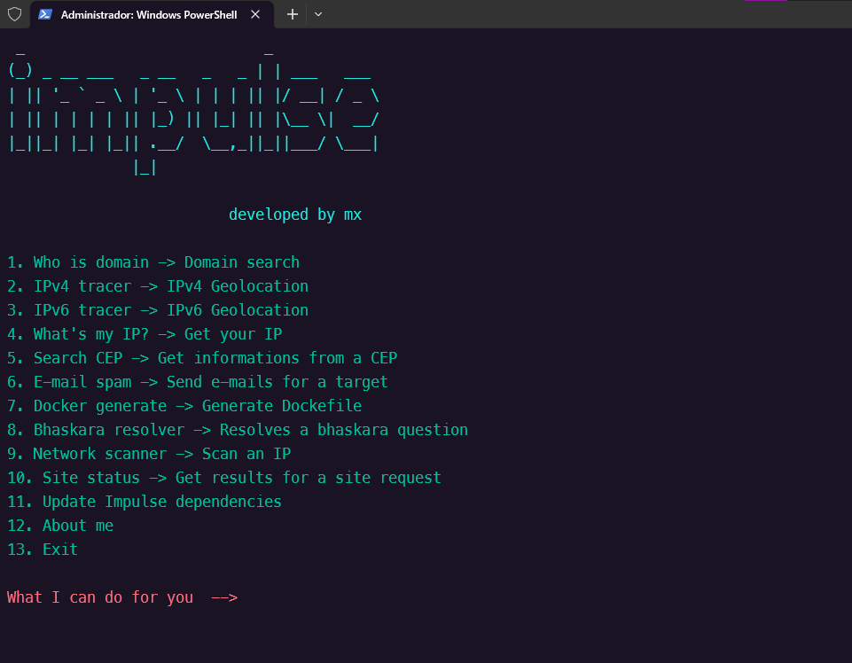

# Impulse
### A simple app tools for pentest and cybersecurity.

## Features
<ul>
  <li>Who is domain</li>
  <li>IPv4 geolocation tracer</li>
  <li>IPv6 geolocation tracer</li>
  <li>What's my IP?</li>
  <li>Search informations from CEP</li>
  <li>E-mail spam</li>
  <li>Dockerfile and docker-compose generate <b>(not implemented yet)</b></li>
  <li>Bhaskara resolver (meme)</li>
  <li>Network scanner</li>
  <li>Site status</li>
</ul>

## How to install

<ul>

### <b>Clone the repository from github</b>

```
git clone https://github.com/ofmxtheuuz/impulse
```


### <b>Install dependencies</b>

```
pip install -r requirements.txt
```

### <b>Run the project</b>

```
python main.py
```

### <b>Follow me on github</b>
S2

</ul>

<br>

## Printscreen

